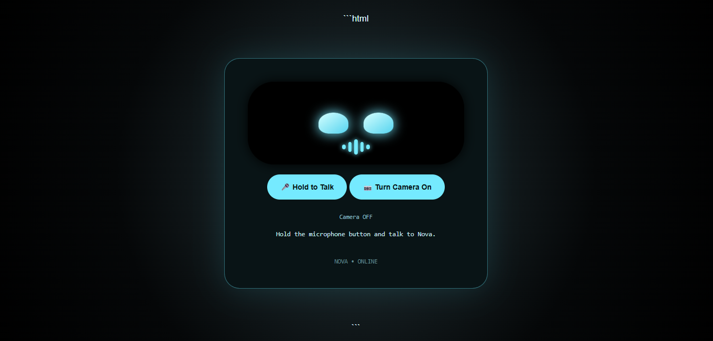

# 🤖 NOVA — The AI Partner

> A voice-enabled AI companion that can listen, speak, think, react, and interact with you through voice and camera.

## 📸 Preview

****

## 🎥 Demo

**[▶️ Watch Nova in Action](assets/demo.mp4)**

---

## ✨ Features

* 🗣️ **Voice Interaction** — Talk naturally with Nova using your microphone.
* 🔊 **Text-to-Speech** — Nova speaks its responses using your browser's speech engine.
* 🇮🇳 **English + Hindi Support** — Supports conversations in both English and Hindi.
* 🧠 **AI Conversations** — Uses Groq AI for intelligent responses.
* ⚡ **Local Fallback Brain** — Common conversations can be answered locally without calling the AI API.
* 😊 **Emotion System** — Nova changes its expressions depending on the conversation.
* 📷 **Camera Presence Detection** — Nova can react when you enter or leave the camera view.
* 🤔 **Thinking Animation** — Nova visually reacts while processing responses.
* 🎤 **Push-to-Talk** — Nova listens only when you intentionally activate the microphone.
* 🌐 **Local Web Application** — Runs locally using Node.js and Express.

---

## 🧠 How Nova Works

```text
                    ┌─────────────────┐
                    │      USER       │
                    └────────┬────────┘
                             │
                    Voice / Text / Camera
                             │
                             ▼
                 ┌──────────────────────┐
                 │   NOVA WEB INTERFACE │
                 └──────────┬───────────┘
                            │
              ┌─────────────┼─────────────┐
              │             │             │
              ▼             ▼             ▼
       Speech-to-Text   Camera Input   User Input
              │             │
              ▼             ▼
        User Message   Presence Detection
              │
              ▼
       ┌────────────────┐
       │  Local Brain   │
       └───────┬────────┘
               │
        Unknown Request
               │
               ▼
       ┌────────────────┐
       │    Groq AI     │
       │  GPT-OSS-20B   │
       └───────┬────────┘
               │
               ▼
          AI Response
               │
               ▼
       ┌────────────────┐
       │ Text-to-Speech │
       └───────┬────────┘
               │
               ▼
          🔊 Nova Speaks
```

---

## 🛠️ Tech Stack

### Frontend

* HTML5
* CSS3
* JavaScript
* Web Speech API
* Speech Recognition API
* Speech Synthesis API
* Camera / MediaDevices API

### Backend

* Node.js
* Express.js
* dotenv

### AI

* Groq API
* `openai/gpt-oss-20b`

---

## 📂 Project Structure

```text
NOVA-The-AI-Partner/
│
├── assets/
│   ├── screenshot.png
│   └── demo.mp4
│
├── public/
│   └── index.html
│
├── .env
├── .env.example
├── .gitignore
├── package.json
├── package-lock.json
├── server.js
└── README.md
```

---

## 🚀 Getting Started

### 1. Clone the repository

```bash
git clone https://github.com/Chaitanya-Raghuwanshi/NOVA-The-AI-Partner.git
```

### 2. Open the project

```bash
cd NOVA-The-AI-Partner
```

### 3. Install dependencies

```bash
npm install
```

### 4. Create your `.env` file

Create a file named `.env` in the project root:

```env
GROQ_API_KEY=your_groq_api_key_here
```

> ⚠️ Never share or commit your real API key.

### 5. Start Nova

```bash
node server.js
```

### 6. Open Nova

Go to:

```text
http://localhost:3000
```

---

## 🧩 Local Fallback Brain

Nova doesn't need to contact the AI API for every message.

The local brain handles common interactions such as:

* 👋 Greetings
* 🤖 Asking Nova's name
* ❤️ Emotional conversations
* 😊 Asking how Nova is doing
* ❓ Asking for help
* 😂 Jokes
* 🕐 Time and date
* 🍕 Food-related conversations
* 🙏 Thank-you messages
* 🌙 Good morning / good night

This helps reduce unnecessary API requests and makes simple conversations faster.

---

## 🎤 Voice Interaction

Nova uses browser-based speech technologies.

### Speech Recognition

Your voice is converted into text using the browser's Speech Recognition API.

```text
🎤 Your Voice
      ↓
Speech Recognition
      ↓
Text
      ↓
Nova
```

### Text-to-Speech

Nova's response is converted back into speech:

```text
Nova Response
      ↓
Speech Synthesis
      ↓
🔊 Nova Speaks
```

Nova also attempts to select appropriate voices for English and Hindi.

---

## 📷 Camera Interaction

Nova can access the user's camera and monitor presence.

When the user appears, Nova can react:

> **"Oh! There you are!"**

When the user leaves:

> **"Where did you go? I can't see you."**

This gives Nova a more interactive companion-like experience.

---

## 😊 Emotion System

Nova has multiple visual emotional states, including:

| Emotion     | Example                |
| ----------- | ---------------------- |
| 😊 Happy    | Friendly conversation  |
| 😢 Sad      | User leaves the camera |
| 🤔 Curious  | Curious interaction    |
| 🧠 Thinking | Processing a response  |
| 🤩 Excited  | Exciting conversation  |
| 😐 Neutral  | Normal state           |

The goal is to make Nova feel more like an interactive companion rather than a simple chatbot.

---

## 🔐 Security

Sensitive credentials are stored using environment variables.

The repository ignores:

```text
.env
node_modules/
```

A `.env.example` file is provided so users know which environment variables are required.

**Never upload your actual API key to GitHub.**

---

## ⚠️ Current Limitations

Nova is still under development.

Some current limitations include:

* Speech recognition depends on browser support.
* Available voices depend on the operating system and browser.
* Camera detection may vary between devices and browsers.
* AI conversations require an active Groq API connection when the local brain cannot answer.
* Browser speech synthesis can behave differently across systems.

---

## 🔮 Future Improvements

Planned improvements include:

* 🧠 Long-term memory
* 👤 More accurate face detection
* 🎭 Advanced facial expressions
* 🎙️ Improved voice recognition
* 🌍 More language support
* 💬 Persistent conversation history
* 🖥️ Desktop application
* 📱 Mobile application
* 🤖 Local AI model support
* 🎨 Customizable personalities
* 🔌 Support for multiple AI providers

---

## 📚 What I Learned

Building Nova helped me learn and practice:

* HTML, CSS and JavaScript
* Node.js
* Express.js
* REST APIs
* AI API integration
* Git and GitHub
* Environment variables
* Speech Recognition
* Text-to-Speech
* Camera APIs
* Frontend ↔ Backend communication
* Debugging
* API error handling
* Building interactive user interfaces

---

## 🤝 Contributing

Contributions, ideas, and improvements are welcome.

To contribute:

1. Fork the repository.
2. Create a new branch.
3. Make your changes.
4. Commit your changes.
5. Open a Pull Request.

---

## 📜 License

This project is licensed under the **MIT License**.

---

## 👨‍💻 Author

### Chaitanya Raghuwanshi

GitHub:
[**@Chaitanya-Raghuwanshi**](https://github.com/Chaitanya-Raghuwanshi)

Project:
[**NOVA — The AI Partner**](https://github.com/Chaitanya-Raghuwanshi/NOVA-The-AI-Partner)

---

## ⭐ Support

If you like Nova, consider giving the repository a ⭐ on GitHub!

It helps support the project and motivates future development.

---

> 🤖 **NOVA is more than a chatbot — it's an experiment in building a personal AI companion that can listen, speak, see, and react.**
